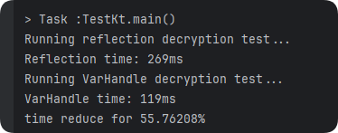

## 摘要
在处理海量数据时，动态修改对象字段是一项常见但极易成为性能瓶颈的操作。本文将深入探讨Java 9引入的`VarHandle`如何在高并发和大数据场景下，作为传统反射（Reflection）的继任者，实现数量级的性能提升。我们将通过一个典型的“字段解密”场景，用基准测试数据说话，揭示`VarHandle`背后的“黑魔法”。

## 1. 痛点场景：当百万级数据遭遇“反射式”解密
想象一个业务场景：我们需要从数据库或消息队列中接收大量（例如，一百万个）用户对象，并对其中标记了`@DecryptField`注解的敏感字段（如姓名、电话）进行解密。这是一个典型的ETL或数据脱敏前置处理任务。

### 传统方案：反射（Reflection）的直观与挣扎
- **实现直观**：通过`Class.getDeclaredFields()`、`field.isAnnotationPresent()`和`field.set()`一套组合拳，代码逻辑清晰易懂。对于一次性任务或小批量数据，这无疑是最快（指开发速度）的解决方案。
- **性能瓶颈**：当数据量达到百万级，循环内部的`field.set()`操作会成为性能的“重灾区”。为什么？我们稍后深入剖析。我们的测试将证明，这种便利性是以牺牲执行效率为代价的。

## 2. 技术对比：VarHandle vs. 反射，一场“降维打击”
在Java 9之前，面对这类需求我们常常得在“便利的反射”和“高性能但复杂的字节码操作”之间做艰难抉择。但现在，我们有了`VarHandle`。它就像是为性能而生的“精确制导导弹”，而反射则更像“地毯式轰炸”，覆盖面广但精准度和效率不足。

### 2.1. 反射（Reflection）的工作原理与开销
- **动态的“安检”**：每次调用`field.get()`或`field.set()`，JVM都需要进行一系列运行时检查。这包括但不限于：权限检查（`setAccessible(true)`只是绕过了Java语言的访问控制，而非JVM的全部安全检查）、方法区查找以确认字段是否存在、以及对传入参数和返回值的类型校验。这个过程在百万次循环中被无情地重复执行，累积的开销相当可观。
- **“装箱拆箱”的隐形杀手**：反射API是基于`Object`设计的。这意味着即使操作的是原生类型（`int`, `double`等），也必须经过自动装箱（boxing）和拆箱（unboxing）的过程，这会产生大量临时对象，给GC带来不必要的压力。

### 2.2. VarHandle：现代Java的“指针”艺术
- **一次查找，终身受益**：`VarHandle`的核心思想是“句柄化”。我们通过`MethodHandles.lookup()`在程序初始化阶段（循环外）一次性找到目标字段，并创建一个`VarHandle`实例。这个创建过程包含了所有必要的权限和类型检查。一旦句柄创建成功，后续的调用就是“直达”内存的操作。
- **静态类型的“快捷通道”**：`VarHandle`是强类型的。它在创建时（`lookup.findVarHandle(...)`）就已经通过`Class`参数确定了字段的类型。因此，后续的`get()`和`set()`操作是类型特定的，JVM可以进行更深度的优化，甚至可能内联（inline）这些调用，使其性能逼近直接的字段访问。
- **并发工具箱的基石**：`VarHandle`不仅快，它还是Java现代并发工具的基石。它提供了标准的内存屏障语义和一套丰富的原子操作（如`compareAndSet`, `getAndAdd`, `getAndBitwiseOr`等），这正是`java.util.concurrent.atomic`包在Java 9+的底层实现方式。

> **核心结论**：反射的性能开销是**每次调用**都必须支付的“过路费”；而`VarHandle`将这笔费用**平摊到了一次性的句柄创建**上。在需要对同一字段进行大量重复操作的场景下，`VarHandle`的优势一目了然。

## 3. 最佳实践：代码基准测试
“Talk is cheap, show me the code.” 让我们用代码来验证这一切。以下是我们的测试靶场，使用Kotlin编写。

```kotlin
import java.lang.invoke.MethodHandles
import kotlin.system.measureTimeMillis

// 定义一个注解，用于标记需要解密的字段
@Target(AnnotationTarget.FIELD)
@Retention(AnnotationRetention.RUNTIME)
annotation class DecryptField

// 数据类，包含一些需要解密的字段
data class User(
    var id: String,

    @DecryptField
    var name: String,

    @DecryptField
    var phone: String,

    var email: String,

    @DecryptField
    var address: String
)

// 模拟的解密函数
fun decrypt(s: String): String = "${s}_decoded"

/**
 * 使用传统反射API进行解密
 */
fun decryptWithReflection(users: List<Any>) {
    // 1. 在循环外，预先找出所有需要处理的字段。这是一个好习惯，避免在主循环中重复获取。
    val fields = users[0]::class.java.declaredFields
        .filter { it.type == String::class.java && it.isAnnotationPresent(DecryptField::class.java) }
        .onEach { it.isAccessible = true } // 关键：打破访问限制

    for (user in users) {
        for (field in fields) {
            val value = field.get(user) as String?
            if (value != null) {
                // 2. 性能瓶颈：每次set都会触发JVM的动态检查机制
                field.set(user, decrypt(value))
            }
        }
    }
}

/**
 * 使用Java 9+ 的VarHandle进行解密
 */
fun decryptWithVarHandle(users: List<Any>) {
    val clazz = users[0].javaClass
    // 1. 创建一个有权访问私有字段的Lookup实例
    val lookup = MethodHandles.privateLookupIn(clazz, MethodHandles.lookup())
    // 2. 关键优化：在循环外，将字段查找和权限检查的开销一次性完成，获取到VarHandle句柄列表
    val handlers = clazz.declaredFields
        .filter { it.type == String::class.java && it.isAnnotationPresent(DecryptField::class.java) }
        .map {
            // 这步包含了所有验证和查找，返回一个高效的字段访问器
            lookup.findVarHandle(clazz, it.name, String::class.java)
        }

    for (user in users) {
        for (handle in handlers) {
            val value = handle.get(user) as String?
            if (value != null) {
                // 3. 高性能操作：此处的set调用几乎等同于直接的字段赋值，开销极小
                handle.set(user, decrypt(value))
            }
        }
    }
}

fun main() {
    // 创建一百万个用户对象用于测试
    val userList1 = List(1_000_000) {
        User("id$it", "name$it", "phone$it", "email$it", "addr$it")
    }
    // 创建一个副本，保证两次测试的输入数据一致
    val userList2 = userList1.map { it.copy() }

    println("Running reflection decryption test...")
    val reflectionTime = measureTimeMillis {
        decryptWithReflection(userList1)
    }
    println("Reflection time: ${reflectionTime}ms")

    println("Running VarHandle decryption test...")
    val varHandleTime = measureTimeMillis {
        decryptWithVarHandle(userList2)
    }
    println("VarHandle time: ${varHandleTime}ms")
    // 计算性能提升百分比
    println("time reduce for ${String.format("%.2f%%", (1 - varHandleTime.toFloat() / reflectionTime) * 100)}")
}
```

## 4. 结果分析与避坑指南

### 4.1. 性能数据解读


根据我们的基准测试结果：


- **反射耗时**: 269ms
- **VarHandle耗时**: 119ms

> 在我们的百万级用户对象、每个对象3个字段的解密测试中（总计三百万次`set`操作），`VarHandle`相比传统反射，**将执行时间缩短了约55.76%**。这有力地证实了`VarHandle`在高性能场景下的绝对优势。

如果操作的字段更多，或者数据量更大，这种性能差异将更加悬殊。

### 4.2. 避坑指南
- **不要在循环中创建VarHandle**：`VarHandle`的创建是有成本的，它的价值在于“一次创建，多次使用”。请务必在循环外部缓存`VarHandle`实例。在循环里`lookup.findVarHandle`，无异于每次上高速都重新建一个收费站，性能会比反射更差。
- **注意模块化（Java 9+）的访问权限**：在模块化的Java项目中，`MethodHandles.privateLookupIn()`能否成功，取决于调用方模块是否被授权可以“深度反射”目标模块。你可能需要在`module-info.java`中`opens`对应的包。
- **适用场景**：如果只是框架初始化时、或者某个一次性工具里进行几次字段访问，反射的便利性依然是首选。但只要你的场景涉及**高频循环**、**高并发**或**底层框架（如序列化、ORM、AOP）开发**，`VarHandle`就是不二之选。

### 4.3. 超越基础：通往更加机制的性能
上面提供的代码只是一个用于清晰对比的**最小化可行示例**。在真实、高并发的生产环境中，性能调优的旅程并未在此结束。我们可以，也应该做得更好。


#### 1. 跨请求的元数据缓存

我们的示例代码中，`fields`和`handlers`是在`decryptWith...`方法内部计算的。这意味着，如果这个解密方法被频繁调用（例如，每个Web请求或每个MQ消息消费都调用一次），那么每次调用都会重新执行一遍“查找所有带注解的字段/句柄”的逻辑。虽然我们已经将其移出了主循环，但这个初始化开销仍然可以被消除。

**实践方案：**
创建一个单例的或由依赖注入框架管理的`DecryptionService`，并在其内部维护一个静态的、线程安全的缓存。

```kotlin
class DecryptionService{
    companion object{
        // 使用ConcurrentHashMap作为缓存，Key是数据类，Value是对应的VarHandle列表
        private val handleCache = ConcurrentHashMap<Class<*>, List<VarHandle>>()
    }
    fun decrypt(target:Any){
        val clazz = target.javaClass
        val handles = handleCache.computeIfAbsent(clazz){
            val lookup = MethodHandles.privateLookupIn(clazz, MethodHandles.lookup())
            it.declaredFields
                .filter { field -> field.isAnnotationPresent(DecryptField::class.java)&&field.type == String::class.java }
                .map { field ->
                    lookup.findVarHandle(it,field.name, String::class.java)
                }
        }
        // 后续和之前相同
        handles.forEach {
            //...
        }
    }
}
```

> **核心思想**：这种缓存策略完美诠释了**享元模式（Flyweight Pattern）**。`VarHandle`列表作为不变的、可共享的“内部状态”被缓存起来，而每次需要操作的对象则是易变的“外部状态”。这使得获取字段操作句柄的成本从“每次调用”降低到了“应用程序生命周期内仅一次”。

## 5. 总结：拥抱未来，明智选择
Java的演进从未停止。`VarHandle`的出现，并非要完全消灭反射，而是为开发者在性能和灵活性之间提供了更精细的权衡。它赋予了我们以接近本地代码的效率去操作对象字段的能力，同时还提供了强大的并发控制原语。

作为追求卓越性能的开发者，下次当您面临类似的挑战时，请记住：**在性能的十字路口，`VarHandle`是通往未来的高速公路。**