## 创建和桥接方法

### `Mono.just(T data)`

创建一个新的 `Mono`，在订阅时立即发出给定的非空元素并完成。如果传入的 `data` 为 `null`，则立即抛出 `NullPointerException`（用户应使用 `justOrEmpty` 处理空值情况）。适用于需要快速构造一个包含单个确定值的 `Mono` 情形。

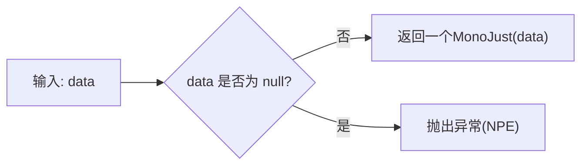

### `Mono.justOrEmpty(Optional<? extends T> optional)`

当 `optional` 有值时发出该值，否则仅完成不发射元素。该方法方便从 `Optional` 构造 `Mono`，在可能为空的场景下使用。例如，数据库查询返回可选结果时使用。内部逻辑：检查 `Optional.isPresent()`，若为真则构造等价于 `Mono.just(value)` 的实例，否则返回 `Mono.empty()`。

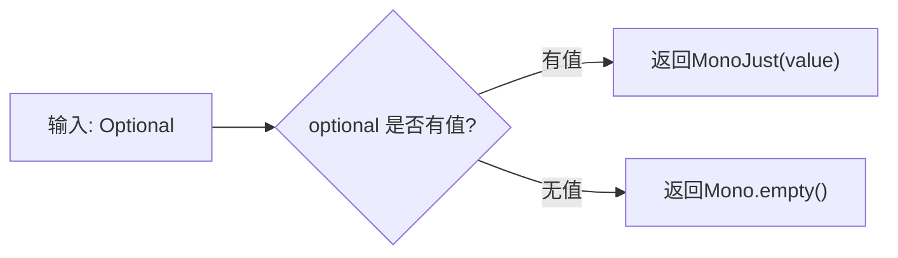

### `Mono.justOrEmpty(T data)`

当 `data` 不为 `null` 时发出该值，否则只完成。等效于接受单个元素版的 `justOrEmpty(Optional.ofNullable(data))`。适用于手头值可能为 `null` 的情形，避免 `NullPointerException`。内部逻辑：检查 `data` 是否为 `null`，非空则新建 `MonoJust`；若为 `null` 则返回 `MonoEmpty`。

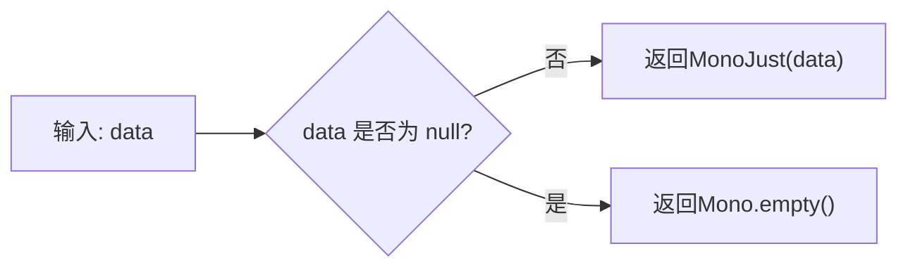

### `Mono.empty()`

返回一个永远只发出完成信号、不发出元素的空 `Mono`。适用于需要返回空结束信号的场景，如无值时的占位。内部是单例实现，订阅者订阅后立即收到 `onComplete` 信号，不执行其他逻辑。

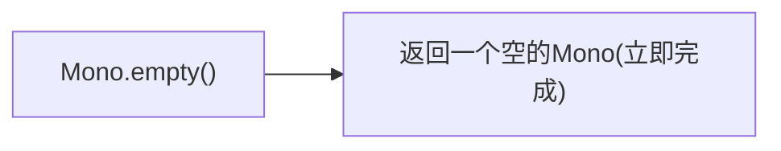

### `Mono.never()`

返回一个永不发出任何数据或终止信号的 `Mono`。用于需要“挂起”或无限等待的场景，例如测试超时或占位作用。内部实现会创建一个永不完成的 `MonoNever`，订阅后既不调用 `onNext` 也不调用 `onComplete/onError`。

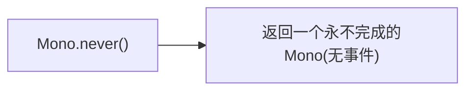

### `Mono.error(Throwable error)`

返回一个在订阅时立即发出错误信号的 `Mono`。适用于需要立即结束且带错误信息的场景，如验证失败时返回错误 Mono。内部逻辑：如果传入的 `error` 为 `null`，则抛出 `NullPointerException`；否则创建一个 `MonoError`，订阅时立即调用 `Subscriber.onError(error)`。

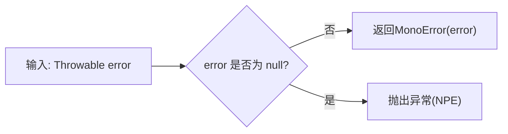

### `Mono.error(Supplier<? extends Throwable> errorSupplier)`

返回一个在订阅时立即使用 `errorSupplier` 提供错误并发出该错误信号的 `Mono`。适用于错误信息需要延迟生成的情况。内部逻辑：订阅时调用 `errorSupplier.get()`，若返回非 `null` 异常则发出该错误；若 `errorSupplier` 本身抛异常或返回 `null`，则转换为相应异常输出。

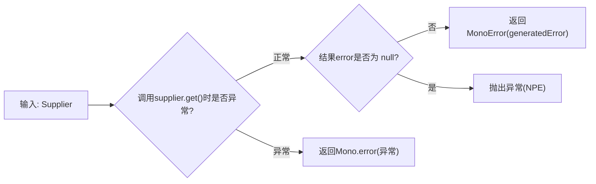

### `Mono.defer(Supplier<? extends Mono<? extends T>> supplier)`

创建一个延迟 `Mono`，每次订阅时调用 `supplier` 生成一个目标 `Mono` 并订阅。适用于每次订阅都要重新构造 `Mono` 的场景，比如需要重新执行查询或获取资源。内部逻辑：订阅时立即调用 `supplier.get()`，若返回 `null` 或抛出异常则转为 `Mono.error`；否则订阅该返回的 `Mono`，并将其信号转发给下游。

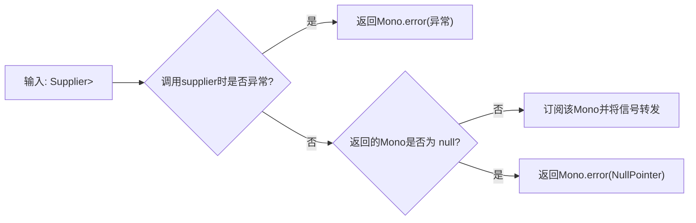

### `Mono.deferContextual(Function<ContextView, ? extends Mono<? extends T>> contextMonoFactory)`

类似 `defer`，但在订阅时可访问当前上下文（`ContextView`）并基于上下文生成 `Mono`。用于需要根据上下文动态决定数据源的场景。内部逻辑：订阅时从订阅者获取上下文视图，并将其传递给 `contextMonoFactory`；若工厂返回 `null` 或抛异常则输出错误，否则订阅生成的 `Mono`。

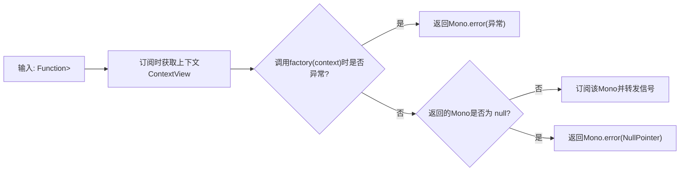

### `Mono.create(Consumer<MonoSink<T>> callback)`

创建一个可用回调 API 信号最多一个值的 `Mono`。适用于将非响应式的回调风格代码桥接为 `Mono` 的场景，例如监听器或异步回调。内部逻辑：订阅时创建一个 `MonoSink`，并将其传给用户提供的 `callback`，用户可以在回调中使用 `sink.success(value)`、`sink.error(err)` 或 `sink.success()` 完成信号；如果回调抛异常则发送错误信号。

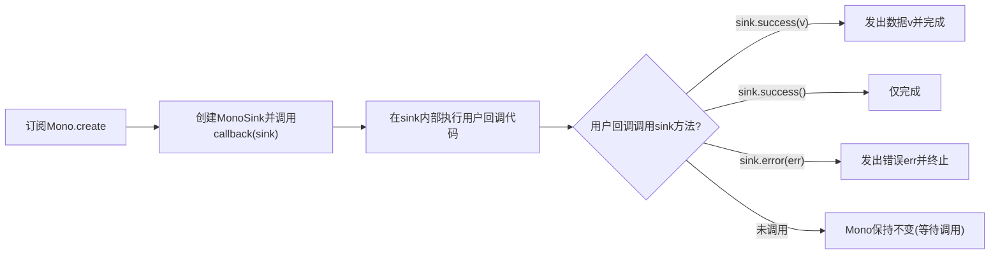

### `Mono.from(Publisher<? extends T> source)`

将任意 `Publisher` 暴露为 `Mono` API，确保其最多发出一个元素。如果 `source` 自身是 `Mono`，则直接返回；否则订阅 `source` 并取第一个元素发送给下游。若有第二个元素到达则会发出 `IndexOutOfBoundsException` 错误。适用于将其他 `Publisher`（如 Flux）转换为 Mono 的场景。内部逻辑：如果 `source` 是 `Mono`，则直接返回；否则创建一个 `MonoNext` 订阅到 `source`，记录首个元素并完成，若发生第二元素则触发错误。

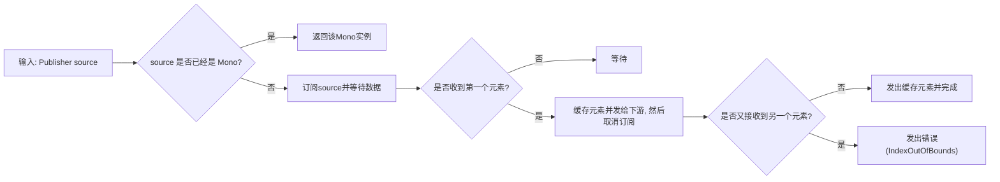

### `Mono.fromCallable(Callable<? extends T> supplier)`

创建一个新的 `Mono`，在订阅时调用给定的 `Callable` 来生成值。适用于需要将同步计算（如方法调用）包装为 `Mono` 的场景。内部逻辑：订阅时执行 `supplier.call()`，若正常返回值则发射该值并完成；如果调用抛异常则发出错误信号。

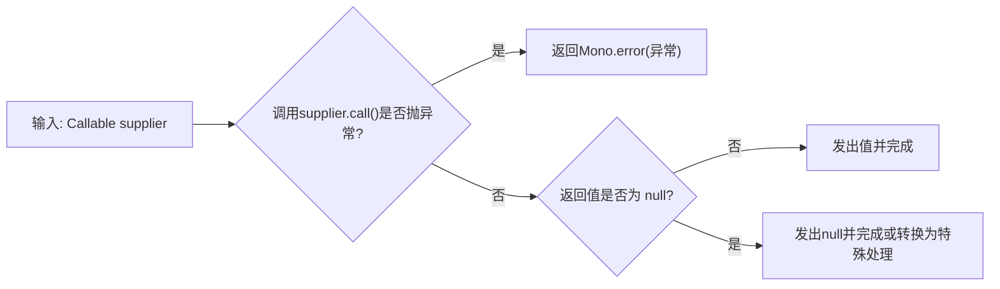

### `Mono.fromSupplier(Supplier<? extends T> supplier)`

与 `fromCallable` 类似，但使用 `Supplier` 接口。订阅时调用 `supplier.get()`，返回值正常时发射并完成，抛异常时发错误。使用场景同样是将同步操作延迟到订阅时执行。

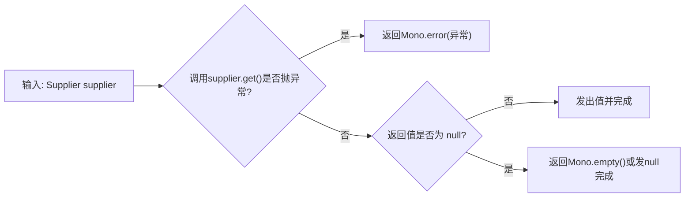

### `Mono.fromCompletionStage(CompletionStage<? extends T> completionStage)`

创建一个新的 `Mono`，在订阅时注册对给定 `CompletionStage` 的回调。当 `CompletionStage` 完成时，如果正常完成则发射结果值并完成，如果异常完成则发错误。适用于将 Java `CompletionStage`（如 `CompletableFuture`）桥接为 `Mono` 的场景。

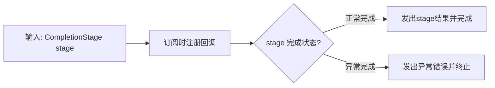

### `Mono.fromCompletionStage(Supplier<? extends CompletionStage<? extends T>> stageSupplier)`

与上一个方法类似，但使用 `Supplier` 延迟提供 `CompletionStage`。订阅时调用 `stageSupplier.get()` 获取 `CompletionStage` 并注册回调。适用于在订阅时才决定或创建 `CompletionStage` 的场景。

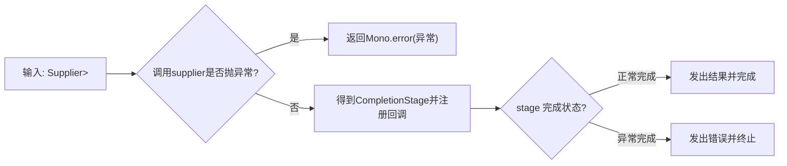

### `Mono.fromFuture(CompletableFuture<? extends T> future)`

创建一个新的 `Mono`，在订阅时注册对给定 `CompletableFuture` 的回调。与 `fromCompletionStage` 类似，默认在取消订阅时取消 `future`。适用于将 `CompletableFuture` 桥接为 `Mono`。内部逻辑：订阅时调用 `future.whenComplete`，在完成时发送结果或错误；如果订阅取消且 `suppressCancel==false`，则调用 `future.cancel()`。

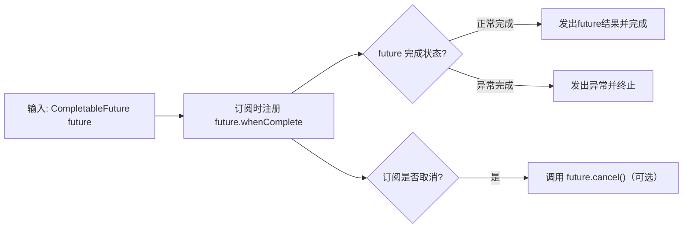

### `Mono.fromFuture(CompletableFuture<? extends T> future, boolean suppressCancel)`

功能与上一方法相同，但允许选择在订阅取消时是否取消 `future`。当 `suppressCancel==false` 时，订阅取消会取消 `future`；若为 `true` 则忽略取消。

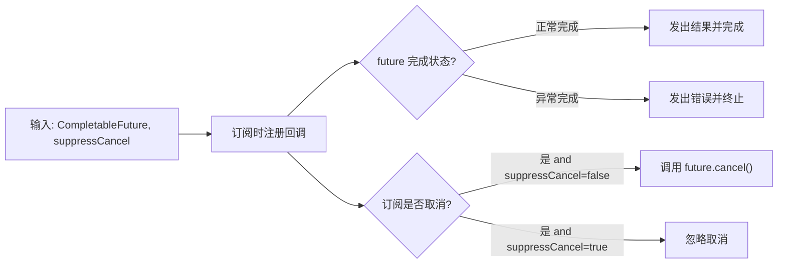

### `Mono.fromFuture(Supplier<? extends CompletableFuture<? extends T>> futureSupplier)`

与 `fromFuture(CompletableFuture)` 类似，但使用 `Supplier` 延迟提供 `CompletableFuture`。订阅时调用 `futureSupplier.get()` 获取 `CompletableFuture` 并注册回调。适用于需要延迟到订阅时才创建 `CompletableFuture` 的场景。

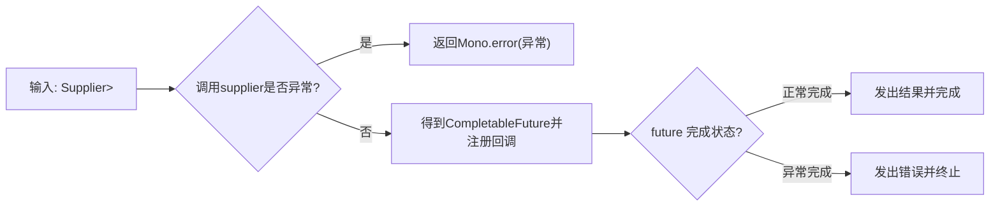

### `Mono.fromFuture(Supplier<? extends CompletableFuture<? extends T>> futureSupplier, boolean suppressCancel)`

与上一方法相同，但允许配置订阅取消时是否取消 `CompletableFuture`。内部逻辑同前，额外处理 `suppressCancel` 参数。

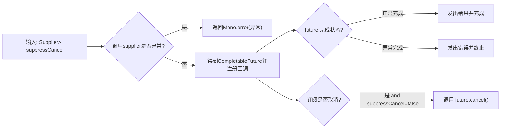

### `Mono.fromRunnable(Runnable runnable)`

创建一个新的 `Mono`，在订阅时执行给定的 `Runnable`，然后完成。不发出任何元素，仅作为完成信号。适用于需要在订阅时执行某些动作（如更新状态、日志等）然后完成的场景。内部逻辑：订阅时调用 `runnable.run()`，如果抛异常则发出错误，否则仅发出完成信号（不调用 `onNext`）。

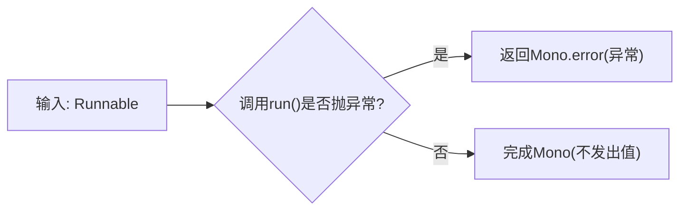

### `Mono.ignoreElements(Publisher<T> source)`

创建一个新的 `Mono`，订阅给定的 `Publisher source` 并丢弃其所有元素，只在 `source` 完成时发出完成信号。适用于只关心完成或错误，不关心数据内容的场景。内部逻辑：订阅 `source`，对每个 `onNext` 丢弃不处理，对 `onComplete` 触发自身完成，对 `onError` 转发错误。

```mermaid
flowchart LR
  A[输入: Publisher source] --> B[订阅source]
  B --> C["onNext(x)" -> 丢弃x]
  B --> D["onError(err) -> Mono.error(err)"]
  B --> E["onComplete -> Mono.complete()"]
```

## 错误处理

（注意：大多数错误处理方法为实例方法，静态方法仅有 `error`。）

上述 **`Mono.error(Throwable)`** 与 **`Mono.error(Supplier<Throwable>)`** 已在创建部分说明。

## 组合与汇聚操作

### `Mono.firstWithSignal(Iterable<? extends Mono<? extends T>> monos)`

返回一个 `Mono`，该 `Mono` 从给定的多个 `Mono` 源中选择最先发出**任何信号**（值、完成或错误）的那个信号并重播。如果第一个信号是值则发出该值完成，如果是错误则直接错误完成，如果第一个信号是完成则完成。适用于竞态场景，取最快响应的 `Mono` 结果。内部逻辑：同时订阅所有输入 `Mono`，监听每个的第一个信号，一旦任何一个发出信号（包括完成或错误）即取消其他并返回该信号。

```mermaid
flowchart LR
  A[输入: Monos列表] --> B[并发订阅所有Mono]
  B --> C{有Mono发出信号?}
  C -- 首个信号为值v --> D[取消其他Mono,发出v并完成]
  C -- 首个信号为错误e --> E[取消其他Mono,发出错误e]
  C -- "首个信号为完成(empty)" --> F[取消其他Mono,直接完成]
```

### `Mono.firstWithValue(Mono<? extends T> first, Mono<? extends T>... others)` 和 `Mono.firstWithValue(Iterable<? extends Mono<? extends T>> monos)`

返回一个 `Mono`，从给定多个 `Mono` 源中选择最先**发出值**的那个并重播该值。如果最快的发出是完成（无值）则忽略它，直到某个 `Mono` 发出值或所有都完成。适用于竞态场景中希望第一个有值时就返回结果。内部逻辑：并发订阅所有 `Mono`，监视值信号。第一个发出值的 `Mono` 触发结果值并取消其他；若有 `Mono` 错误则直接错误完成；若所有 `Mono` 都完成且都无值，则整体完成。

```mermaid
flowchart LR
  A[输入: Monos列表] --> B[并发订阅所有Mono]
  B --> C{有Mono发出值?}
  C -- 是 --> D[取消其他Mono,发出该值并完成]
  C -- 否并至少一个Mono错 --> E[发出错误并结束]
  C -- 否并所有完成无值 --> F[直接完成]
```

### `Mono.when(Iterable<? extends Publisher<?>> sources)` 和 `Mono.when(Publisher<?>... sources)`

聚合给定的所有发布者，当**所有**源都完成时返回一个只完成、不发出值的 `Mono<Void>`。若任何一个源发布错误，则立即终止并发出该错误。适用于需要等待多个异步任务全部完成的场景。内部逻辑：同时订阅所有 `sources`，跟踪完成计数和错误。一旦所有源完成且无错误，则发出完成；若任何源错误则立即错误终止其他订阅。

```mermaid
flowchart LR
  A[输入: Publishers列表] --> B[并发订阅所有sources]
  B --> C{有source发出错误?}
  C -- 是 --> D[取消其他source,发出错误并结束]
  C -- 否 --> E{所有sources完成?}
  E -- 否 --> F[等待剩余完成]
  E -- 是 --> G["发出完成信号(Mono<Void> 完成)"]
```

### `Mono.whenDelayError(Iterable<? extends Publisher<?>> sources)` 和 `Mono.whenDelayError(Publisher<?>... sources)`

功能与 `when` 类似，但在出现错误时推迟报错，直到所有源都完成为止。在任何源出错时，它会收集错误并继续等待其他源完成，最后再以复合错误终止。适用于希望即使有错误也等待其他任务完成、然后统一处理错误的场景。内部逻辑与 `when` 类似，但对错误不立即抛出，而是在所有订阅结束后再一次性抛出（可能会聚合多个错误）。

```mermaid
flowchart LR
  A[输入: Publishers列表] --> B[并发订阅所有sources]
  B --> C{有source发出错误?}
  C -- 是 --> D[记录错误,但继续监听其他sources]
  B --> E{所有sources完成?}
  E -- 否 --> F[等待完成]
  E -- 是 --> G{是否有记录的错误?}
  G -- 否 --> H["发出完成信号(Mono<Void> 完成)"]
  G -- 是 --> I[发出记录的第一个错误或聚合错误并结束]
```

### `Mono.zip(Function<? super Object[],? extends R> combinator, Mono<?>... monos)` 和 `Mono.zip(Iterable<? extends Mono<?>> monos, Function<? super Object[],? extends R> combinator)`

使用提供的函数将多个 `Mono` 组合为一个新 `Mono`。只有当所有输入 `Mono` 都发出值时，才使用 `combinator` 函数来合并这些值并发出结果。如果任一输入 `Mono` 发出错误，则直接错误；如果任一输入完成但不发值，则最终不发值完成。适用于需要将多个 `Mono` 的结果合并计算的场景（类似于并行执行多个异步任务后聚合结果）。内部逻辑：并发订阅所有 `monos`，缓存每个的唯一值，一旦所有都就绪，则调用 `combinator` 并发出；若有错误则立即错误。

```mermaid
flowchart LR
  A[输入: Monos列表 + combinator] --> B[并发订阅所有Mono]
  B --> C{有Mono发出错误?}
  C -- 是 --> D[取消其他Mono,发出错误并结束]
  C -- 否 --> E{所有Mono都发出值?}
  E -- 否 --> F[等待剩余值]
  E -- 是 --> G[调用combinator合并值,并发出结果]
  G --> H[完成]
```

### `Mono.zip(Mono<? extends T1> p1, Mono<? extends T2> p2)`, `Mono.zip(Mono<? extends T1> p1, Mono<? extends T2> p2, BiFunction<? super T1,? super T2,? extends O> combinator)`, … (最多支持到八个 `Mono` 组合)

这些是 `zip` 的重载形式，将 2 到 8 个 `Mono` 按元素顺序合并为一个 `Mono<TupleN>` 或者使用 `BiFunction` 等函数合并两个值。内部逻辑与上一条通用 `zip` 一致，只是合并函数或输出类型不同：当所有参与 `Mono` 都发出各自的元素后，将它们按顺序组合（构造 `Tuple` 或调用函数）并发出。如果任何一个出错则错误终止；如果任何一个完成不发值，则最终不发值完成。

```mermaid
flowchart LR
  A[输入: Mono p1, p2, ..., combinator] --> B[并发订阅所有Mono]
  B --> C{有Mono发出错误?}
  C -- 是 --> D[取消其他Mono,发出错误并结束]
  C -- 否 --> E{所有Mono都发出值?}
  E -- 否 --> F[等待剩余值]
  E -- 是 --> G[按顺序收集值,调用合并函数发出结果Tuple]
  G --> H[完成]
```

### `Mono.zipDelayError(…)`

与 `Mono.zip(...)` 类似，但在出现错误时会聚合等待其它 `Mono` 结束再发错误。具体来说，它提供 3 到 8 个 `Mono` 的重载版本，行为与相应的 `zip` 相同，但如果多个源出现错误，会在全部结束后一次性报告（通常只报告第一个错误）。适用于想要所有 `Mono` 都尝试运行，即使有错误也继续合并其它结果的场景。

```mermaid
flowchart LR
  A[输入: 多个Mono + combinator] --> B[并发订阅所有Mono]
  B --> C{有Mono发出错误?}
  C -- 是 --> D[记录错误, 不立即停止订阅其他]
  B --> E{所有Mono都结束?}
  E -- 否 --> F[等待]
  E -- 是 --> G{是否有错误记录?}
  G -- 否 --> H[正常按照值合并发出结果]
  G -- 是 --> I[发出错误并结束]
```

### `Mono.sequenceEqual(Publisher<? extends T> source1, Publisher<? extends T> source2)` 及其重载

比较两个 `Publisher` 发出的元素序列是否完全相同，对应位元素通过相等谓词比较，结果为 `Mono<Boolean>`。适用于需要检查两个异步序列是否等价的场景。内部逻辑：同时订阅两个 `source`，逐对读取元素并比较：如果某对元素不相等，则立即返回 `false`；如果序列长度不同（一个先结束但另一个还有元素），则返回 `false`；如果两个序列同步结束且所有元素都相等，则返回 `true`。

```mermaid
flowchart LR
  A[输入: Publisher1, Publisher2] --> B[并发订阅两个源]
  B --> C{读取到元素?}
  C -- 两者都获取到元素x,y --> D{"x.equals(y)"?}
  D -- 否 --> E["取消订阅其他, 返回Mono.just(false)"]
  D -- 是 --> F[继续比较下一对元素]
  C -- 一方先结束 --> G{另一方是否还有元素?}
  G -- 是 --> H["返回Mono.just(false)"]
  G -- 否 --> I["返回Mono.just(true)"]
```

## 资源管理

### `Mono.using(Callable<? extends D> resourceSupplier, Function<? super D, ? extends Mono<? extends T>> sourceSupplier)`

创建一个使用外部资源的 `Mono`，资源类型 `D` 必须实现 `AutoCloseable`。在订阅时通过 `resourceSupplier` 获取资源实例，传递给 `sourceSupplier` 以创建一个数据源 `Mono<T>`；无论该源 `Mono` 是正常完成还是错误完成，都会在最终调用资源的 `close()` 方法回收资源。适用于需要在异步流程中自动打开和关闭资源（如文件、数据库连接）的场景。内部逻辑：调用 `resourceSupplier` 获取资源 `res`；调用 `sourceSupplier(res)` 得到一个 `Mono<T>` 并订阅；当该 `Mono<T>` 完成或错误时（以及订阅取消时，根据 `eager` 参数），调用 `res.close()` 以释放资源。

```mermaid
flowchart LR
  A[资源管理: Callable<D>, sourceFunction] --> B{调用resourceSupplier是否异常?}
  B -- 是 --> C["返回Mono.error(异常)"]
  B -- 否 --> D[得到资源res]
  D --> E["调用sourceFunction(res)得到Mono源S并订阅"]
  E --> F{S完成或错误?}
  F -- 是 --> G["调用res.close()释放资源"]
  G --> H[转发完成或错误给下游]
```

有重载版本 `using(..., boolean eager)` 控制资源释放时机：“`eager=true`” 表示在源信号发出后立即释放资源；“`eager=false`” 表示在信号发出后再延迟一轮后释放资源。

### `Mono.usingWhen(Publisher<D> resourcePublisher, Function<? super D, ? extends Mono<? extends T>> resourceClosure, Function<? super D, ? extends Publisher<?>> asyncCleanup)` 及其重载

使用响应式资源管理的 `Mono` 操作。`resourcePublisher` 提供资源 `D`（如数据库事务管理器），`resourceClosure` 使用该资源构建工作流 `Mono<T>`；`asyncCleanup` 是一个函数，根据资源 `D` 返回另一个 `Publisher<?>` 用于清理资源。在资源流发出元素 `d` 后，订阅 `resourceClosure(d)` 生成的 `Mono<T>`，并在该 `Mono<T>` 完成或错误时调用对应的清理 `Publisher`。重载允许分别指定在正常完成 (`asyncComplete`) 或出错 (`asyncError`) 时的异步清理逻辑。适用于事务或连接等需要异步关闭的资源场景。内部逻辑：订阅 `resourcePublisher` 得到资源 `d`，再订阅 `resourceClosure(d)` ；若正常完成，则使用 `asyncCleanup(d)` 或 `asyncComplete(d)` 来清理；若错误完成，则使用 `asyncError(d, error)` 清理。

```mermaid
flowchart LR
  A["资源管理(响应式): Publisher<D>, resourceClosure, asyncCleanup"] --> B[订阅resourcePublisher获取资源d]
  B --> C["订阅sourceMono = resourceClosure(d)"]
  C --> D{sourceMono 完成方式?}
  D -- 正常完成 --> E["调用asyncCleanup(d)清理资源"]
  D -- 错误完成 --> F["调用asyncCleanup(d)清理资源"]
  E --> G[下游接收完成或错误信号]
  F --> G
```

（重载版本可针对正常完成和错误完成采用不同的清理函数。）

## 参考资料

* Reactor 官方文档（3.7.x 版本）中的 `Mono` API 说明。每个方法的具体行为描述即来源于以上文档内容。
* Reactor 核心源码。上述逻辑概要基于 Reactor 源码中对各静态方法实现的阅读和理解。各流程图反映了源码中的分支和信号流程。
