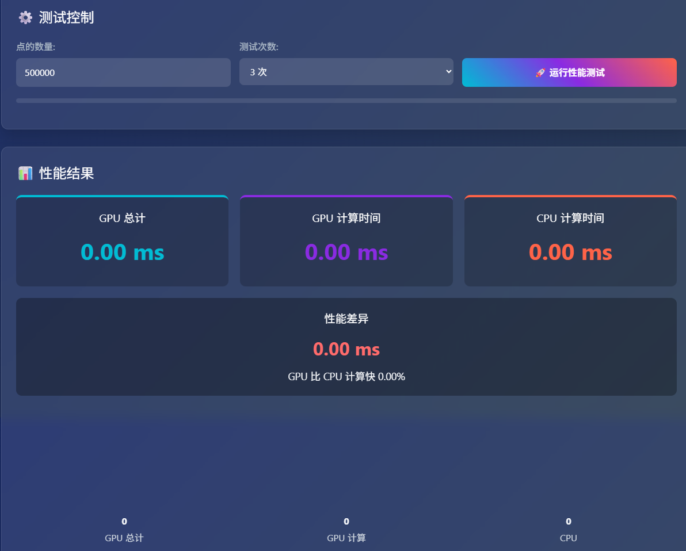
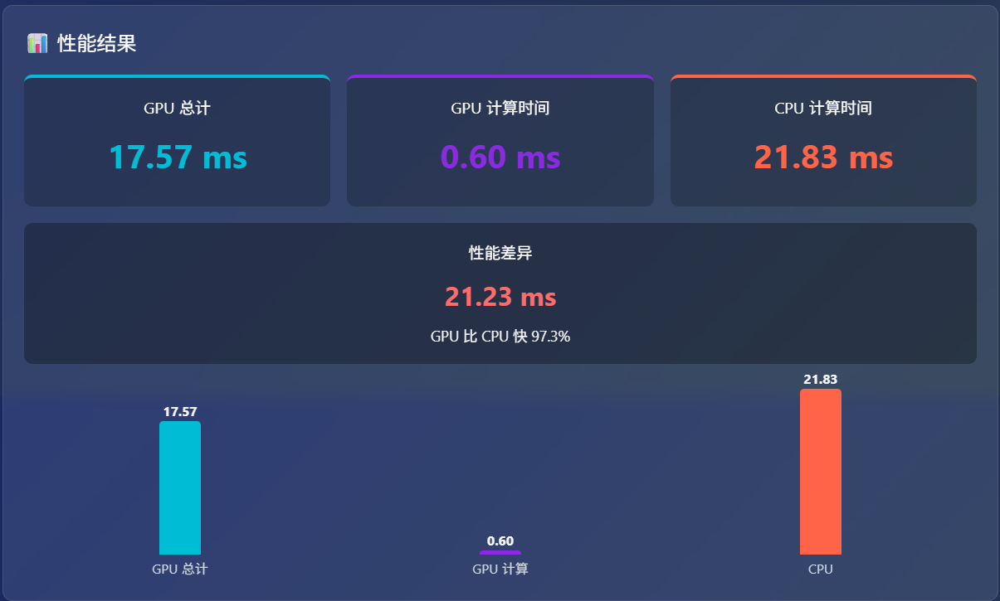

在现代前端开发中，**性能瓶颈**一直是影响用户体验和交互流畅度的核心问题。尤其是涉及大量数据计算时，传统 CPU 的线性处理方式往往力不从心。幸运的是，WebGPU 的出现为 Web 端并行计算带来了新的可能。

本文将通过一个**实际的性能测试案例**，直观地比较 WebGPU 和传统 JavaScript（CPU）在处理大规模点距计算任务中的表现差异。

---

## 📌 测试目标

我们模拟了一个二维空间中的**最近邻查找**问题。给定一个目标点 `(x, y)`，从几十万的点集中找出与它距离最近的点。

### 对比内容包括：

* GPU 计算时间（不含数据传输）
* GPU 总时间（含写入缓冲、执行、读取结果）
* CPU 计算时间
* GPU 相比 CPU 的性能提升百分比

---

## 🧪 测试界面



---

## 🧠 背后原理简述

### 1️⃣ GPU 计算流程

* 使用 WebGPU 的 compute shader 批量计算每个点到目标点的欧几里得距离。
* 每个 `workgroup_size = 64`，调度 `ceil(N / 64)` 个工作组。
* 计算结果写入 GPU 存储缓冲区。
* 最终通过 `mapReadAsync` 拿到最近邻结果。

```wgsl
@compute @workgroup_size(64)
fn main(@builtin(global_invocation_id) gid : vec3<u32>) {
    let i = gid.x;
    if (i >= arrayLength(&points)) {
        return;
    }
    let d = distance(points[i].pos, u_target);
    partial[i] = Result(d, i);
}
```

### 2️⃣ CPU 对比流程

传统方式通过 `for` 循环遍历数组计算距离，逻辑简单但不可并行。

---

## 🧩 性能分析机制

我们使用了 WebGPU 的 `timestamp-query` 进行 GPU 精确耗时统计，同时也使用 `performance.now()` 做 CPU 计时。

为了精度和可重复性，用户可以选择运行多轮测试，自动计算平均值，并通过柱状图直观展示。

> 注意：为了使用 timestamp-query，需要在 Chrome 开启 flag：
> `chrome://flags/#enable-unsafe-webgpu`

---

## 📊 示例测试结果（500,000 个点 × 3 次）



### 🎯 结论：

* **WebGPU 的并行计算能力在处理大数据时有压倒性的优势**。
* 在 50 万个点的最近邻计算中，GPU 比 CPU 的计算速度快 **97%**。
* GPU 数据传输会消耗远超计算所需的时间。
* 当点数较少时，GPU 初始化/传输时间可能不划算；但随着数据量增长，优势迅速扩大。

---

## ⚠️ 注意事项

* WebGPU 的 compute shader 调度有以下关键限制：

  1. 每个维度（x、y、z）的最大工作组数不得超过 `maxComputeWorkgroupsPerDimension`（通常是 65535）。

  2. 每个工作组内部最多可包含 `maxComputeInvocationsPerWorkgroup` 个线程（例如 256 或 1024），而每个维度的 @workgroup_size(x, y, z) 又分别受 maxComputeWorkgroupSizeX/Y/Z 限制。

* 如果你试图调度超过这些上限的工作组数量，例如：

```typescript
dispatchWorkgroups(156250, 1, 1); // ❌ 超过 65535
```
* 将会报错：
```text
Dispatch workgroup count X exceeds max compute workgroups per dimension
```

* 当前实现仅使用单阶段 shader，没有做全流程 GPU 归约（也即最近邻查找的最终比较仍在 CPU 完成），但已足够用于展示 GPU 的**并行计算能力**。

---

## 🧩 运行方式

本项目仅依赖原生 Web API，**无需任何第三方库**。支持 Chrome 113+（需手动启用 WebGPU）。

在线测试地址：[GPUTestCase](/extras/GPUTestCase/)

---

## 🚀 总结

WebGPU 作为 Web 平台下 GPU 并行计算的新标准，展现出了强大的性能潜力。通过这次对比，我们可以看到：

| 场景         | 建议使用方式        |
| ---------- | ------------- |
| 小数据量、低延迟   | 仍适合 CPU       |
| 大数据量、重复批处理 | 强烈推荐使用 WebGPU |
