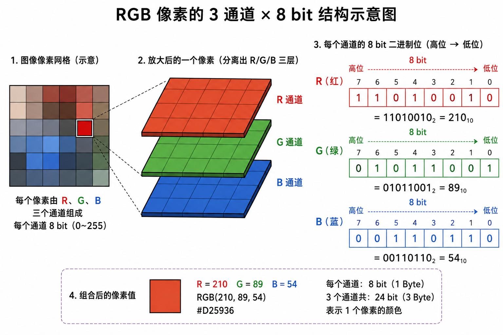
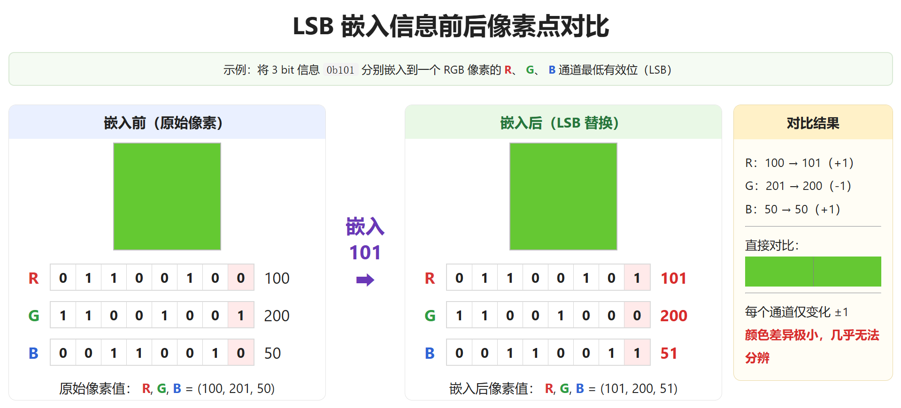
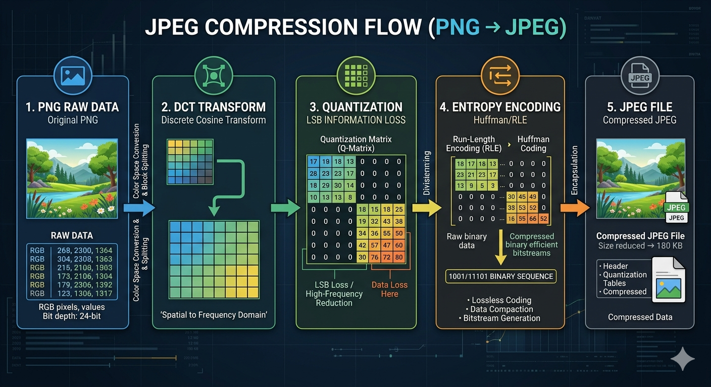

想象一个场景：你需要在公开的图片中传递一段信息，但这张图片在任何人看来都必须是"正常的"——不能有水印，不能改变尺寸，文件大小不能异常，用任何元数据清理工具也扫不出端倪。

这听起来像间谍电影，但实现它的核心技术只有三个字母：**LSB**。

---

## 三种思路，两个陷阱

在图片里藏信息，直觉上你会想到三种方案：

**方案 A：视觉水印。** 直接在图片上写文字，或者叠加半透明图层。问题很明显——人眼可见，等于自曝。即便把透明度调到 5%，用图层差分工具几秒就能提取出原始水印。

**方案 B：追加二进制。** 把数据塞在文件尾部，或者插入自定义 Chunk（如 PNG 的 tEXt 块）。这类方案有一个致命缺陷：元数据清理工具（如 `exiftool -all=`）会直接将其抹除。CDN 服务、社交媒体平台在转储图片时也常会剥离非关键 Chunk。

**方案 C：LSB 像素隐写。** 把信息编码进图片像素本身的颜色值中。它不是图片的"附件"，它就是图片本身。这就是我们要深入的方向。

---

## 一、像素的二进制本质

一张 PNG 图片，放大到极致，你看到的是一个个方块——**像素**。每个像素由三个颜色通道构成：红（R）、绿（G）、蓝（B），每个通道的取值范围是 **0 ~ 255**。

为什么是 255？因为每个通道用 **8 个比特（bit）** 存储，2^8 = 256 种可能。一个像素的颜色，在计算机眼里就是三个 8 位二进制数：

```
像素颜色 RGB(100, 200, 50)

R: 100 → 0 1 1 0 0 1 0 0
G: 200 → 1 1 0 0 1 0 0 0
B:  50 → 0 0 1 1 0 0 1 0
```



对于一个 1920×1080 的图片，有 2,073,600 个像素，每个像素 3 个通道（RGB），一共 **6,220,800 个字节**的数据在流动。而 LSB 隐写的核心思路就是——借用每个字节的**最后一位**。

### 关于 PNG 颜色类型的选择

PNG 规范定义了多种颜色类型（colorType），并非所有类型都适合 LSB 隐写：

| colorType | 通道结构 | 每像素通道数 | 适合 LSB？ |
|---|---|---|---|
| 0 | 灰度 | 1 | 不适合——单通道，容量太小 |
| 2 | **RGB** | **3** | **推荐——三通道无 Alpha，LSB 操作最安全** |
| 3 | 索引色 | 1（调色板索引） | 不适合——修改 LSB 会跳变到完全不同的颜色 |
| 4 | 灰度 + Alpha | 2 | 不适合——容量有限，且修改 Alpha 影响透明度 |
| 6 | RGBA | 4 | 可用但不推荐——修改 Alpha 通道 LSB 可能影响图片合成效果 |

**本系列所有方案均基于 colorType=2（RGB）的 PNG 文件。** RGB 的三个通道都是纯颜色数据，LSB 修改不会产生任何副作用。colorType=6（RGBA）理论上多一个通道可以利用，但 Alpha 通道控制透明度，在某些合成场景（如叠加到不同背景上）中 LSB 扰动可能被放大，因此不纳入标准方案。

> **如果你用截图工具或画图软件导出 PNG，默认通常是 colorType=2（RGB）。如果你不确定手头图片的类型，可以用 `pngjs` 或 `exiftool` 查看。**

---

## 二、"1/255" 的微调艺术

一个字节有 8 个比特。最高位（MSB，Most Significant Bit）决定了数值的大头，最低位（LSB，Least Significant Bit）只影响 "加 1 还是不加 1"。

举个例子：

```
颜色值 100 (二进制 01100100)
把 LSB 从 0 改成 1 → 01100101 = 101
把 MSB 从 0 改成 1 → 11100100 = 228
```

改最高位，颜色跳变 128，肉眼可见。改最低位，颜色变化最多 **1/255 ≈ 0.4%**。

> **在 24 位真彩色（1600 万色）的屏幕上，相邻像素之间的颜色差异通常远超 1，人眼根本无法察觉单个通道 ±1 的变化。**

这就是 LSB 隐写的物理基础：把秘密信息的每一个比特，分别替换到不同像素通道的最低位中。

```
原始像素:  R=100  G=200  B=50
秘密比特:  1     0      1
修改后:    R=101  G=200  B=51  ← 肉眼看起来和原来一模一样
```



---

## 三、为什么 PNG 能胜任，而 JPEG 不行

这个问题的答案决定了你的隐写方案是**有效还是白忙一场**。

### PNG / BMP：无损格式

PNG 使用 DEFLATE 压缩算法，**是可逆的**。压缩-解压后，每一个像素的每一个比特都精确还原。你嵌入 LSB 的信息，原封不动地保存在文件中。

就像你把纸条夹进一本书里——把书合上再打开，纸条还在。

### JPEG：有损格式

JPEG 的核心是 **DCT（离散余弦变换）+ 量化**。它把图像从空间域转换到频域，然后丢弃人眼不敏感的高频分量。

关键在这里：**DCT 量化会修改像素的低位比特**。你精心写入 LSB 的秘密信息，在 JPEG 保存的那一瞬间，就被量化算法当作"视觉冗余"丢弃了。

```
原始 PNG 像素:  0110010[1] ← LSB 藏着我们的秘密比特
                        ↓ JPEG 压缩
JPEG 解压后:    0110101[0] ← LSB 已经面目全非
```



> **一条铁律：LSB 隐写必须使用无损格式。PNG 是最佳选择——支持透明通道、压缩率适中、Web 生态广泛兼容。**

BMP 理论上也可以（无压缩），但文件体积巨大，不适合传播。

---

## 下一篇

理解了 LSB 的原理，你可能会想：把文本转成比特流一个一个塞进像素，代码写起来复杂吗？如果要藏的不是文本，而是一个 PDF 文件呢？解码的时候程序怎么知道该在哪里停下来？

下一篇，我们将进入真正的工程落地：[《把文本写进像素：LSB 隐写术的工程化与 TypeScript 实现》](/blog/bf1ac0404cfc/)
