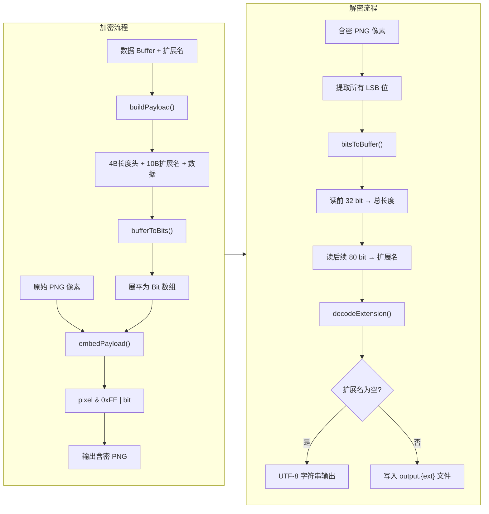

[上一篇](/blog/26789e42aaa2/) 我们理解了 LSB 的物理原理：修改像素通道的最低位，人眼无法察觉。但原理和工程之间，还隔着两个必须回答的问题：

1.  如果藏的不是纯文本，而是一个 PDF 或 ZIP 文件呢？
2.  解码程序读完像素后，怎么知道该在哪里停下来？

这两个问题不解决，LSB 就只是一段"懂原理但写不出来"的课后习题。

---

## 一、一切皆 Buffer

第一个问题其实是个思维转换题。纯文本是字节，PDF 是字节，ZIP 也是字节——在 Node.js 里，它们都是 `Buffer`。

```typescript
import { readFileSync } from 'fs';

// 文本文件是 Buffer
const text = Buffer.from('Hello, 世界', 'utf-8');

// PDF 文件也是 Buffer
const pdf = readFileSync('./secret.pdf');

// 对 LSB 来说，它们没有区别——就是一串待编码的字节
```

所以我们的目标不是"把字符串塞进图片"，而是 **"把任意 Buffer 塞进图片"**。

但这引出了一个问题：解码端拿到还原后的 Buffer，它应该生成一个 `.txt` 文件，一个 `.pdf` 文件，还是直接当字符串打印出来？

> **我们需要在数据前面告诉解码端：这段二进制数据原本是什么类型。**

---

## 二、固定扩展名字段：10 字节的类型标签

解决方案是在数据头部加入一个**固定的扩展名字段**。10 个字节，ASCII 编码，右侧空位填 `0x00`。

```
数据结构：[4字节长度] [10字节扩展名] [数据本体]
```

为什么是固定长度？因为解码端不需要猜测扩展名有多长——它永远读固定的 80 个比特（10 字节 × 8 bit），然后 trim 掉尾部的 `0x00` 就是扩展名。

**规则很简单：**

| 扩展名原始值 | 编码后的 10 字节 | 含义 |
|---|---|---|
| `""` (空) | `[00 00 00 00 00 00 00 00 00 00]` | 纯文本 |
| `"pdf"` | `[70 64 66 00 00 00 00 00 00 00]` | PDF 文件 |
| `"tar.gz"` | `[74 61 72 2E 67 7A 00 00 00 00]` | 压缩包 |

解码端读取这 10 个字节后：
- 全为零 → 把数据按 UTF-8 解码成字符串
- 非零 → 写入文件，扩展名取 trim 后的值

```typescript
function encodeExtension(ext: string): Buffer {
  // 统一小写，截断到 10 字符，创建 10 字节 Buffer（自动填 0x00）
  const normalized = ext.toLowerCase().slice(0, 10);
  const buf = Buffer.alloc(10);
  buf.write(normalized, 0, 'ascii');
  return buf;
}

function decodeExtension(buf: Buffer): string {
  // trim 掉尾部的 0x00
  let end = 10;
  while (end > 0 && buf[end - 1] === 0x00) end--;
  return buf.subarray(0, end).toString('ascii');
}
```

---

## 三、4 字节长度头：告诉解码端"读到哪里停"

LSB 解码时，程序会把图片所有像素的 LSB 位串成一条比特流。但这条流的长度 = 图片像素数 × 3，往往远超数据实际需要的位数。

如果不知道数据长度，解码端要么读不够，要么读过头（把图片末尾无关像素的 LSB 也当数据解析了）。

解决方案：在数据最前面写入一个 **4 字节（32 位）的无符号整数**，表示后面还有多少字节的数据。

```
┌────────────────┬───────────────────┬─────────────────────┐
│  4 字节总长度   │  10 字节扩展名     │  数据本体            │
│  (32-bit uint) │  (ASCII + 0x00填) │  (任意二进制)        │
└────────────────┴───────────────────┴─────────────────────┘
```

---

## 四、加密：从 Buffer 到像素

现在把整个流程串起来。加密端输入**数据 Buffer + 可选的扩展名**，输出修改后的像素。

### 第一步：构建 Payload

```typescript
function buildPayload(data: Buffer, ext: string = ''): Buffer {
  const extBuf = encodeExtension(ext);
  const totalLen = 10 + data.length; // 扩展名(10) + 数据体长度
  const header = Buffer.alloc(4);
  header.writeUInt32BE(totalLen, 0);

  return Buffer.concat([header, extBuf, data]);
}
```

> **总长度 = 10 + data.length，不包含长度头自身的 4 字节。**解码端先读 4 字节得知总长，再读 10 字节扩展名，剩下的 data.length = totalLen - 10 就是数据本体。

### 第二步：展平为比特数组

```typescript
function bufferToBits(buf: Buffer): number[] {
  const bits: number[] = [];
  for (const byte of buf) {
    for (let i = 7; i >= 0; i--) {
      bits.push((byte >> i) & 1);
    }
  }
  return bits;
}
```

### 第三步：写入像素 LSB

```typescript
function embedPayload(pixels: Buffer, payload: Buffer): Buffer {
  const bits = bufferToBits(payload);
  const maxBits = pixels.length; // 每个字节存 1 bit

  if (bits.length > maxBits) {
    throw new Error(
      `数据过大：需要 ${bits.length} 比特，图片只能容纳 ${maxBits} 比特`
    );
  }

  const result = Buffer.from(pixels); // 不修改原始数据
  for (let i = 0; i < bits.length; i++) {
    // 清空最低位，然后写入我们的比特
    result[i] = (result[i] & 0xFE) | bits[i];
  }
  return result;
}
```

`pixel & 0xFE` 是一个常见的位运算技巧。`0xFE` = `11111110`，按位与运算会保持高 7 位不变，最低位清零。然后 `| bit` 把我们的秘密比特填进去。

```
原始字节: 01100100  (100)
& 0xFE  : 01100100  (清空 LSB)
| bit=1 : 01100101  (写入 1，结果 = 101)
```

---

## 五、解密：从像素到原始数据

解密是加密的逆过程。

### 第一步：从像素提取比特

```typescript
function bitsToBuffer(bits: number[]): Buffer {
  const bytes: number[] = [];
  for (let i = 0; i < bits.length; i += 8) {
    let byte = 0;
    for (let j = 0; j < 8 && i + j < bits.length; j++) {
      byte = (byte << 1) | bits[i + j];
    }
    bytes.push(byte);
  }
  return Buffer.from(bytes);
}
```

### 第二步：按结构解析

```typescript
function extractPayload(pixels: Buffer): { ext: string; data: Buffer } {
  // 提取所有 LSB 位
  const bits = [];
  for (let i = 0; i < pixels.length; i++) {
    bits.push(pixels[i] & 1); // 只取最低位
  }

  // 1. 读 4 字节长度头 (32 bits → 4 bytes)
  const lenBuf = bitsToBuffer(bits.slice(0, 32));
  const totalLen = lenBuf.readUInt32BE(0);

  const payloadBitLen = totalLen * 8;
  const payloadBits = bits.slice(32, 32 + payloadBitLen);
  const payloadBuf = bitsToBuffer(payloadBits);

  // 2. 读 10 字节扩展名
  const extBuf = payloadBuf.subarray(0, 10);
  const ext = decodeExtension(extBuf);

  // 3. 读数据本体
  const data = payloadBuf.subarray(10, 10 + (totalLen - 10));

  return { ext, data };
}
```

### 第三步：还原输出

```typescript
import { writeFileSync } from 'fs';

function savePayload(ext: string, data: Buffer): void {
  if (ext === '') {
    // 纯文本 —— 直接打印或保存为 .txt
    console.log(data.toString('utf-8'));
  } else {
    // 文件 —— 还原扩展名写入磁盘
    writeFileSync(`output.${ext}`, data);
  }
}
```

---

## 六、完整流程示意



将以上函数组合起来，完整的加密流程如下：

```typescript
import { readFileSync, writeFileSync } from 'fs';
import { PNG } from 'pngjs';

function encodeImage(
  imagePath: string,
  outputPath: string,
  data: Buffer,
  ext: string = ''
): void {
  const png = PNG.sync.read(readFileSync(imagePath));
  const payload = buildPayload(data, ext);
  const modifiedPixels = embedPayload(png.data, payload);

  // 将修改后的像素写回 PNG 结构
  const output = new PNG({ width: png.width, height: png.height });
  output.data = modifiedPixels;

  writeFileSync(outputPath, PNG.sync.write(output));
}
```

解密同理——读取 PNG，提取 LSB 位流，解析 Payload 结构，按扩展名还原文件或文本。

如果你想直接试一下完整流程，可以使用这个在线版本：[LSB 图片隐写工具](/extras/lsb-tool/)。

---

## 下一步

写完代码，你的 LSB 隐写工具已经可以工作了。但它有一个盲区：如果有人在你传输的图片上修改了几个像素，解码端会毫无察觉地输出被篡改的数据。

下一篇我们将引入 **HMAC**——一个 32 字节的数字指纹，让任何篡改都能被立即发现：[《隐写不隐身：为 LSB 加上 HMAC 防篡改与 AES 防窃听》](/blog/74991bb71075/)
