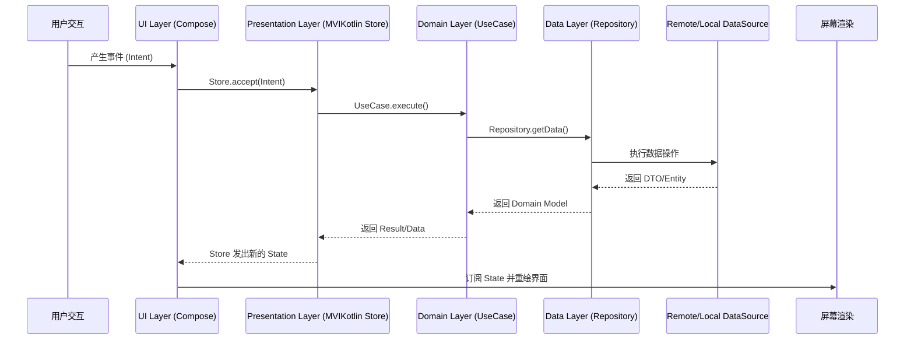

一个采用 Compose Multiplatform 的 KMM 项目能够实现极致的代码复用，将业务逻辑、状态管理、导航甚至 UI 层都放在共享模块中。这使得开发团队可以用单一代码库为 Android、iOS、桌面和 Web 构建功能与外观高度一致的应用。

## 整体结构概览

此架构的核心是将所有代码（包括 UI）都集中在 `shared` 模块中。平台模块 (`androidApp`, `iosApp` 等) 的角色被最小化，仅作为应用的启动入口和共享 UI 的承载容器。

```
my-kmm-project/
├── composeApp/                     # 所有Kotlin代码的单一Gradle模块
│   └── src/
│       ├── commonMain/             # 所有平台共享的代码 (内核库)
│       │   └── kotlin/com/example/myapp/
│       │       ├── App.kt          # 共享UI的根 (Composable Root)
│       │       ├── di/             # 共享的 Koin 模块
│       │       ├── data/           # 数据层 (Ktor, Room)
│       │       ├── domain/         # 领域层 (UseCases)
│       │       ├── presentation/   # 表现层逻辑 (MVIKotlin Stores)
│       │       ├── navigation/     # 共享导航 (Voyager)
│       │       ├── ui/             # 共享 UI (Compose)
│       │       └── platform/       # 平台相关API的 `expect` 声明
│       │
│       ├── androidMain/            # Android 平台的特定代码 (启动器+实现)
│       │   ├── kotlin/com/example/myapp/
│       │   │   └── MainActivity.kt # Android平台的应用入口
│       │   └── AndroidManifest.xml # Android应用的清单文件
│       │
│       ├── iosMain/                # iOS 平台的特定代码 (桥接+实现)
│       │   └── kotlin/com/example/myapp/
│       │       └── Main.kt         # iOS平台的桥接代码，将共享UI打包成UIViewController
│       │
│       ├── jvmMain/                # JVM平台的共享代码 (Android，Desktop)
│       │   └── kotlin/com/example/myapp/
│       │       └── platform/       # JVM通用的文件处理、数据库驱动
│       └── desktopMain/            # Desktop特定代码
│           └── kotlin/com/example/myapp/
│               └── Main.kt         # 桌面应用入口
│
└── iosApp/                         # Xcode项目 (纯粹的iOS容器)
    └── iosApp/
        └── ContentView.swift       # Swift UI代码，用于调用和展示iosMain中生成的UIViewController
```

## 各层详细说明 (全部位于 `shared/commonMain`)

### 1. UI 层 - Compose Multiplatform
所有 Composable 组件、屏幕和主题都在此定义一次，即可在所有目标平台上运行。
```
ui/
├── theme/                # 应用主题，一次定义，多平台共用
│   └── AppTheme.kt
├── components/           # 可重用的共享 Composable 组件
│   └── AppButton.kt
└── screens/              # 应用的所有屏幕
    └── home/
        └── HomeScreen.kt # 共享的 Composable 屏幕
```

### 2. Navigation 层 - Voyager
Voyager 是一个专为 KMM 和 Compose Multiplatform 设计的声明式导航库，让导航逻辑完全共享。
```
navigation/
├── AppNavigation.kt      # 定义 Navigator 和导航图
├── HomeScreen.kt         # 定义 Home 屏幕的 Voyager Screen 对象
└── ProfileScreen.kt      # 定义 Profile 屏幕的 Voyager Screen 对象
```

### 3. Presentation 层 - MVIKotlin
负责管理 UI 状态和处理用户交互，完全独立于 UI 框架。
```
presentation/
└── home/
    ├── HomeStore.kt        # MVIKotlin Store，处理业务逻辑和状态
    ├── HomeStoreFactory.kt # 创建 Store 实例
    └── HomeState.kt        # 定义 UI 状态
```

### 4. Domain 层
包含核心业务逻辑和规则，是应用中最稳定、最纯粹的一层。
```
domain/
├── model/                # 业务领域模型 (e.g., User.kt)
├── repository/           # 仓库接口定义 (e.g., UserRepository.kt)
└── usecase/              # 业务用例 (e.g., GetUserUseCase.kt)
```

### 5. Data 层
负责所有数据的来源和管理，如网络请求和本地数据库。
```
data/
├── local/                # 本地数据源 (Room, Room在2.7.0以后已经支持KMP)
├── remote/               # 远程数据源 (Ktor Client)
├── repository/           # 仓库接口的实现
└── mapper/               # 数据模型转换器
```

### 6. DI 层 - Koin
Koin 为整个共享模块提供依赖注入支持，轻松将各层串联起来。
```
di/
├── AppModule.kt          # 聚合所有模块的 Koin Module
├── DataModule.kt         # 提供数据层依赖
├── DomainModule.kt       # 提供领域层依赖
└── PresentationModule.kt # 提供表现层依赖
```

## 平台模块职责

平台模块非常“薄”，仅负责初始化应用并启动共享 UI 以及平台特定实现。

### 1. **`commonMain/Main.kt` 示例:**
```kotlin
@Composable
fun App() {
    MaterialTheme {
        // ... 你的所有共享UI和业务逻辑都在这里
        Text("Hello, KMP from commonMain!")
    }
}
```
### 2. **`androidApp/MainActivity.kt` 示例:**
```kotlin
class MainActivity : AppCompatActivity() {
    override fun onCreate(savedInstanceState: Bundle?) {
        super.onCreate(savedInstanceState)
        setContent {
            // 这里是Android平台对共享代码的调用点
            App()
        }
    }
}
```

### 3. **`iosMain/kotlin/Main.kt` 入口点概念示例:**
```swift
import androidx.compose.ui.window.ComposeUIViewController

// 这个函数是iOS平台调用共享代码的桥梁
fun MainViewController() = ComposeUIViewController {
    // 这里是iOS平台对共享代码的调用点
    App() 
}
```

### 4. **`desktopMain/kotlin/Main.kt` 入口点概念示例:**

桌面应用的入口是一个标准的`main`函数。

```kotlin
import androidx.compose.ui.window.Window
import androidx.compose.ui.window.application

fun main() = application {
    // 创建一个窗口
    Window(onCloseRequest = ::exitApplication, title = "My KMP App") {
        // 这里是Desktop平台对共享代码的调用点
        App()
    }
}
```

## 数据流向示意图

整个应用的数据流和用户事件循环都发生在 `shared` 模块内部，实现了真正的单一逻辑。

## 设计原则

1.  **最大化代码共享**: UI、导航、状态管理、业务逻辑和数据访问几乎 100% 共享。
2.  **单一代码库**: 只需编写和维护一套核心代码，极大缩短开发周期，降低维护成本。
3.  **平台无关性**: `shared` 模块不依赖任何特定平台的框架，通过 `expect/actual` 机制处理平台差异。
4.  **高度可测试性**: 共享模块中的所有代码都是纯 Kotlin，可以轻松进行单元测试，无需模拟器或设备。
5.  **体验一致性**: 确保各平台的用户体验和功能表现高度统一。
