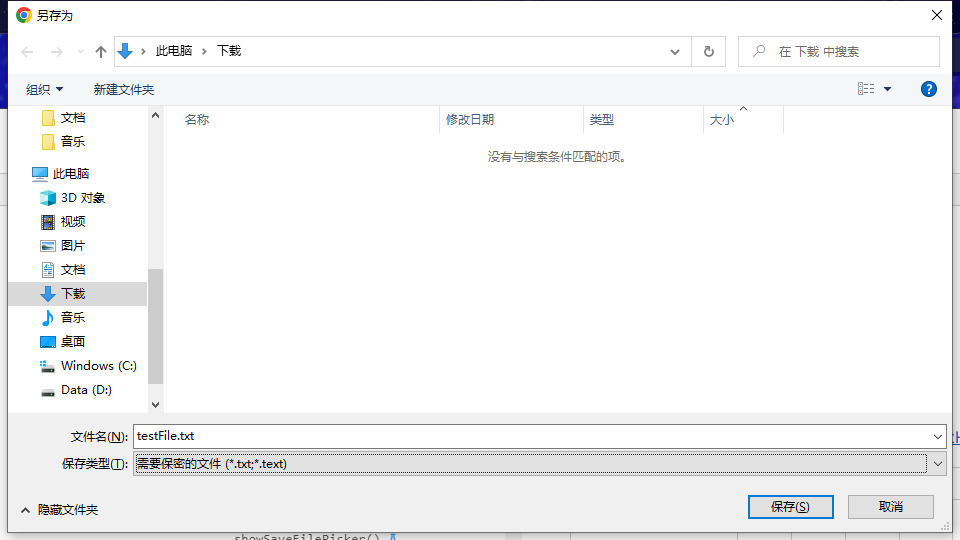

## 注意事项

1. 由于 **File Access API** 会直接操作硬盘上的文件，因此 **必须在受信任的 HTTPS 环境或 `localhost` 域名下使用**。
2. 所谓“受信任”是指：
    - 网站使用 **HTTPS 协议** 与用户建立连接；
    - 网站的 **SSL 证书受信且未过期**。
3. 整个流程需要用户 **主动触发**，且触发窗口内浏览器需处于活跃状态；**如果完全由代码自动触发，可能会被浏览器拦截**。
4. 该方法**无法完全防止用户获取真实下载地址**：因为文件仍需从远程地址获取，只是不显示在浏览器的下载列表。有技术能力的用户仍能获取原始链接。
5. **建议在实际应用中检查浏览器支持情况**，如有必要，为用户提供传统下载方式作为备选。

> 本文档面向高级前端开发者，旨在介绍如何借助 File Access API，在确保用户主动交互的前提下，**隐藏实际下载链接**并安全地将文件保存至本地。此方案提升了用户体验与隐私性，但**不能完全防止有技术能力的用户发现源地址**。

## 1. 文件基本数据获取
对于固定的文件名或者有规则的文件，这些数据可以事先约定。如果文件名等信息不是固定的或者有约定的，可以通过`fetch`发起一次`head`请求，获取响应头的`Content-disposition`部分；例如，需要下载的文件是一个txt文件，那么它的响应头应该类似于:`attachment;filename=testFile.txt`。这样就可以获取到文件的实际名称和扩展名以及扩展名对应的mimeType。
如果文件名包含非ascii码字符，还需要使用`decodeURIComponent`方法解码文件名。
## 2. 让用户选择保存文件的地址和名称
使用第一步获取到的数据创建一个保存文件的配置，这里依然以txt文件作为例子，根据数据，文件的建议名称为`testFile`,扩展名为`txt`,文件类型为`text/plain`，另外可以给保存类型加一个描述，这里就定为`需要保密的文件`。整个组装起来就如下：
```javascript
const opts = {
    suggestedName:"testFile",
    types: [
        {
            description: "需要保密的文件",
            accept: { "text/plain": [".txt"] },
        },
    ],
}
```
如果存在能保存为其它类型或者描述的，可以在types中继续添加，或者在accept中添加  
然后使用[showSaveFilePicker api](https://developer.mozilla.org/en-US/docs/Web/API/Window/showSaveFilePicker),将上面的配置传入，浏览器会自动调起文件保存的弹窗，并且使用上述的配置项。
```javascript
const saveFileHandle = await showSaveFilePicker(opts);
```

如果不想要用户自定义扩展名可以添加`opts.excludeAcceptAllOption=true`,限制用户在保存类型选项只能使用提供的扩展名而不能切换为通用的`*.*`格式。  
如果用户放弃保存，`showSaveFilePicker`会抛出一个`AbortError`。
## 3. 获取文件与创建读写流
使用fetch或者其他网络请求api获取文件的二进制流，并转换为`ArrayBuffer`。如果文件比较大，建议在下载时告诉用户下载进度，如果文件非常非常大，可能还需要[File API](https://developer.mozilla.org/en-US/docs/Web/API/File_API)和[FetchEvent](https://developer.mozilla.org/en-US/docs/Web/API/FetchEvent)以及分段下载的组合使用防止爆掉内存。  
这里给一个获取文件arrayBuffer的示例
```javascript
const response = await fetch('https://example.com/secretList.txt')
const buffer = await response.arrayBuffer()
```
然后使用用户的文件句柄创建一个可写流
```javascript
const writableFileStream = await saveFileHandle.createWritable()
```
然后将文件流写入文件就可以了
```javascript
await writableFileStream.write(buffer)
```
如果还有数据流加密，也可以在这一步解密  
最后，不要忘记关闭读写流，告知浏览器下载已经结束与防止内存泄漏或错误的文件占用
```javascript
writableFileStream.close()
```
## 4. 最终的结果
```javascript
async function saveFile(){
    const opts = {
        suggestedName:"testFile",
        types: [
            {
                description: "需要保密的文件",
                accept: { "text/plain": [".txt"] },
            },
        ],
    };
    const saveFileHandle = await showSaveFilePicker(opts);
    const response = await fetch('https://example.com/secretList.txt')
    const buffer = await response.arrayBuffer()
    const writableFileStream = await saveFileHandle.createWritable()
    await writableFileStream.write(content)
    writableFileStream.close()
}
```
## 5. 补充：
1. 用户放弃保存时抛出的`AbortError`不是AbortError的实例，他是一个`DOMException`实例，在异常处理时不能使用`error instanceOf AbortError`判断, 可以使用`error.name==='AbortError'`