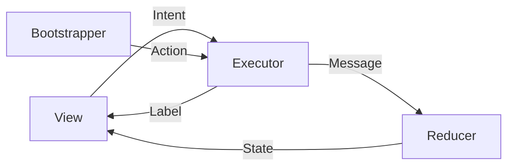

在 Android 及 Kotlin Multiplatform (KMP) 开发中，MVIKotlin 是一个非常流行且强大的状态管理框架。而在 MVIKotlin 的架构核心——`Store` 中，**Executor（执行器）** 扮演着“大脑”的角色，负责处理业务逻辑、异步操作和副作用。

`CoroutineExecutor` 是基于 Kotlin Coroutines 实现的 Executor，也是最常用的实现方式。在定义一个 `CoroutineExecutor` 时，我们需要面对五个泛型参数：

```kotlin
open class CoroutineExecutor<Intent, Action, State, Message, Label>
```

很多初学者容易在这里混淆，特别是 `Intent` vs `Action`，以及 `Message` vs `Label`。本文将详细拆解这五个参数的含义、作用以及它们在数据流中的位置。

---

## 1. MVIKotlin 的数据流向总览

在深入参数之前，我们先看一张简化的流程图，理解 Executor 处于什么位置：



可以看到，**Executor 是输入的汇聚点，也是输出的源头（除了 State 的计算）**。

---

## 2. 五大泛型参数详解

### 1. Intent (意图)

*   **定义**：`Intent` 代表**外部**对 Store 的输入，通常来自 View 层（UI）。
*   **来源**：用户交互。
*   **作用**：表达用户想要做什么。
*   **代码示例**：
    ```kotlin
    sealed interface Intent {
        data class TypeUserName(val text: String) : Intent
        data class TypePassword(val text: String) : Intent
        data object ClickLogin : Intent
    }
    ```
*   **在 Executor 中的处理**：
    你需要在 `executeIntent(intent: Intent)` 方法中处理它。例如，当收到 `ClickLogin` Intent 时，你会启动一个协程去调用 API。

### 2. Action (动作)

*   **定义**：`Action` 代表**内部**对 Store 的输入，通常来自 `Bootstrapper`。
*   **来源**：Store 的生命周期事件或内部触发器。
*   **作用**：处理初始化逻辑或非用户触发的逻辑。
*   **区别**：
    *   `Intent` 来自用户（点击按钮）。
    *   `Action` 来自系统（Store 创建时自动加载数据、后台定时器）。
*   **代码示例**：
    ```kotlin
    sealed interface Action {
        data object InitCheckLoginStatus : Action
    }
    ```
*   **在 Executor 中的处理**：
    你需要在 `executeAction(action: Action)` 方法中处理它。例如，Store 启动时 `Bootstrapper` 发出 `InitCheckLoginStatus`，Executor 收到后检查本地 Token。

### 3. State (状态)

*   **定义**：`State` 是整个屏幕或组件在某一时刻的数据快照。
*   **特性**：**不可变 (Immutable)** 数据类。
*   **作用**：驱动 UI 渲染。Executor 在执行逻辑时，可以通过 `getState()` 获取当前状态，以便根据当前情况做决策（例如：如果已经在加载中，则忽略登录点击）。
*   **代码示例**：
    ```kotlin
    data class State(
        val email: String = "",
        val isLoading: Boolean = false,
        val isLoggedIn: Boolean = false
    )
    ```

### 4. Message (消息)

*   **定义**：`Message` 是 Executor 发送给 **Reducer** 的内部信号。
*   **作用**：**这是唯一能改变 State 的途径。** Executor 处理完业务逻辑（如网络请求成功）后，不能直接修改 State，而是通过 `dispatch(message)` 发送一个 Message。
*   **为什么需要它？**：为了遵循**单一职责原则**。Executor 负责“做异步任务”，Reducer 负责“纯函数式的状态计算”。Message 是它们之间的协议。
*   **代码示例**：
    ```kotlin
    sealed interface Message {
        data class EmailChanged(val text: String) : Message
        data object LoadingStarted : Message
        data class LoginSuccess(val user: User) : Message
        data class LoginError(val error: Throwable) : Message
    }
    ```
*   **流程**：`Executor` -> `dispatch(Message)` -> `Reducer(State, Message)` -> `New State`。

### 5. Label (标签/单次事件)

*   **定义**：`Label` 代表**一次性**的副作用（Side Effect），直接发送给 View。
*   **作用**：处理那些不应该保存在 State 中的事件。
*   **典型场景**：
    *   页面跳转（Navigation）。
    *   显示 Toast 或 Snackbar。
    *   播放音效。
    *   触发震动。
*   **区别 State**：State 是“状态”（如：显示错误红框），Label 是“事件”（如：弹出一个错误提示框）。State 具有粘性（重组后还在），Label 是一次性的（消费即焚）。
*   **代码示例**：
    ```kotlin
    sealed interface Label {
        data object NavigateToHome : Label
        data class ShowErrorToast(val msg: String) : Label
    }
    ```
*   **在 Executor 中的处理**：通过 `publish(label)` 发送。

---

## 3. 实战：将它们串联起来

让我们通过一个**用户登录**的场景，看这些参数如何在 `CoroutineExecutor` 中协同工作。

### 定义部分

```kotlin
// 1. Intent: 用户点的
sealed interface LoginIntent {
    data class InputEmail(val text: String): LoginIntent
    data object Submit : LoginIntent
}

// 2. Action: 自动发生的（如进入页面自动检查历史记录）
sealed interface LoginAction {
    data object CheckHistory : LoginAction
}

// 3. State: 界面展示的
data class LoginState(
    val email: String = "",
    val isLoading: Boolean = false
)

// 4. Message: 告诉 Reducer 改数据的
sealed interface LoginMessage {
    data class SetEmail(val text: String) : LoginMessage
    data object SetLoading : LoginMessage
    data object SetSuccess : LoginMessage
}

// 5. Label: 告诉 View 跳转或弹窗的
sealed interface LoginLabel {
    data object GoToMainScreen : LoginLabel
    data class ShowToast(val text: String) : LoginLabel
}
```

### Executor 实现部分

```kotlin
class LoginExecutor : CoroutineExecutor<LoginIntent, LoginAction, LoginState, LoginMessage, LoginLabel>() {

    // 处理 Action (来自 Bootstrapper)
    override fun executeAction(action: LoginAction, getState: () -> LoginState) {
        when (action) {
            is LoginAction.CheckHistory -> {
                // 模拟逻辑：如果有历史记录，填充 Email
                val historyEmail = "user@example.com" 
                // 发送 Message 给 Reducer 更新 State
                dispatch(LoginMessage.SetEmail(historyEmail))
            }
        }
    }

    // 处理 Intent (来自 View)
    override fun executeIntent(intent: LoginIntent, getState: () -> LoginState) {
        when (intent) {
            is LoginIntent.InputEmail -> {
                // 用户输入时，直接分发消息更新 State
                dispatch(LoginMessage.SetEmail(intent.text))
            }
            is LoginIntent.Submit -> {
                val currentState = getState()
                // 防抖动：如果正在加载，不处理
                if (currentState.isLoading) return

                login(currentState.email)
            }
        }
    }

    private fun login(email: String) {
        scope.launch { // 使用 CoroutineExecutor 自带的 scope
            // 1. 通知 UI 显示 Loading
            dispatch(LoginMessage.SetLoading) 
            
            try {
                // 2. 执行异步网络请求
                val result = repo.login(email) 
                
                // 3. 成功：通知 Reducer 状态变更
                dispatch(LoginMessage.SetSuccess)
                
                // 4. 成功：通知 UI 跳转 (Label)
                publish(LoginLabel.GoToMainScreen)
                
            } catch (e: Exception) {
                // 5. 失败：通知 UI 弹窗 (Label)
                publish(LoginLabel.ShowToast("Login Failed"))
            }
        }
    }
}
```

---

## 4. 总结与最佳实践

| 参数          | 方向    | 谁发起的？        | 用途               | 是否持久化？ | 对应 Executor 方法  |
|:------------|:------|:-------------|:-----------------|:-------|:----------------|
| **Intent**  | 进     | View (用户)    | 业务逻辑触发           | 否      | `executeIntent` |
| **Action**  | 进     | Bootstrapper | 初始化/后台逻辑         | 否      | `executeAction` |
| **State**   | 读     | Reducer 产出   | 逻辑判断依据           | **是**  | `getState()`    |
| **Message** | 出 (内) | Executor     | **修改 State 的指令** | 否      | `dispatch()`    |
| **Label**   | 出 (外) | Executor     | **一次性 UI 事件**    | 否      | `publish()`     |

**最佳实践提示：**

1.  **Intent vs Action**：如果你在 View 层调用了 Store 的方法，那就是 `Intent`。如果 Store 自己启动时就要做事，那就是 `Action`。
2.  **Message vs State**：永远不要在 Executor 中直接修改 State。必须创建 `Message`，然后在 `Reducer` 中生成新的 `State`。
3.  **Label vs State**：
    *   如果数据需要在屏幕旋转后保留（如：加载错误提示文案），放入 `State`。
    *   如果事件只应发生一次（如：Toast 提示“网络错误”），使用 `Label`。
